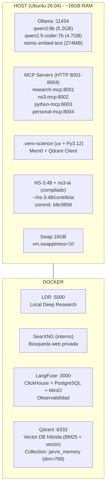
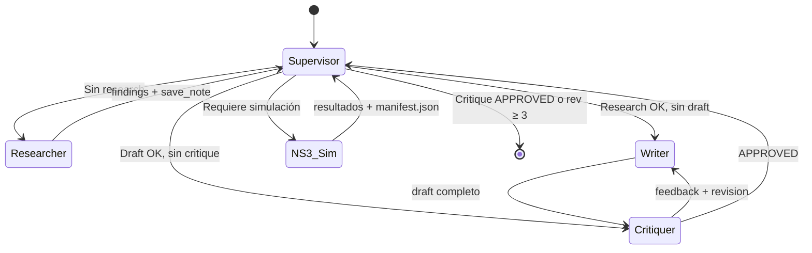
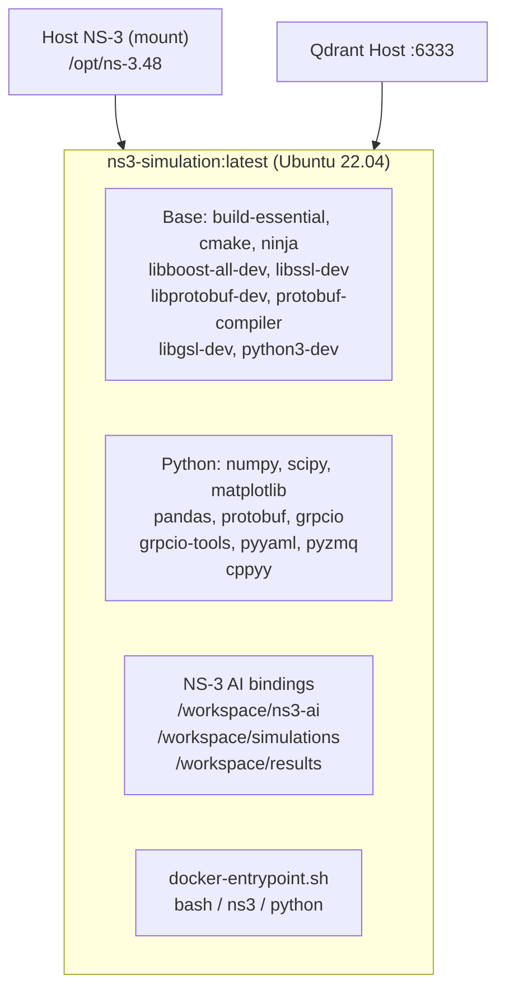

# System Architecture - JARVIS Research

## 🏗️ Visión General (Híbrida Host + Docker)



## 🔄 Flujo de Datos - Orquestador LangGraph v2



## 🧠 Memoria Agéntica (Mem0 + Qdrant)

```mermaid
graph LR
    subgraph AGENTS["Agentes LangGraph"]
        S[Supervisor]
        R[Researcher]
        W[Writer]
        N[NS-3 Agent]
        C[Critiquer]
    end

    subgraph MEMORY["Memoria"]
        EPISODIC[EpisodicMemoryAgent\nrecord_interaction\nget_context_for_task\nlearn_from_error\nrecord_insight]
        SEMANTIC[MemoryAgent (Mem0)\nadd_memory\nsearch_memories\nrecord_error\nrecord_insight]
        QDRANT[(Qdrant :6333\njarvis_memory\ndim=768\nnomic-embed-text)]
        CHROMA[(ChromaDB\n~/chroma/personal/\npersonal-mcp)]
    end

    AGENTS --> EPISODIC
    EPISODIC --> SEMANTIC
    SEMANTIC --> QDRANT
    AGENTS -.-> CHROMA
```

## 🐳 Docker NS-3 Standalone



## 📊 Asignación de Modelos LLM

| Agente | Modelo | Tiempo | Config Crítica |
|--------|--------|--------|----------------|
| Supervisor | qwen3:8b | ~2s | `think:false`, timeout 300s |
| Researcher | qwen3:8b | 92s | `think:false`, timeout 300s |
| Writer | qwen3:8b | 92s | `think:false`, timeout 300s |
| NS-3 Agent | qwen2.5-coder:7b | 37s | Coding especializado |
| Critiquer | qwen3:8b | 92s | `think:false`, timeout 300s |

## 🔌 MCP Servers

| Server | Puerto | Herramientas | LLM Asociado |
|--------|--------|-------------|--------------|
| research-mcp | 8001 | search_papers, search_arxiv, search_openalex, search_crossref, summarize_paper, find_gaps, search_knowledge, save_research_note | qwen3:8b |
| python-mcp | 8003 | run_python, install_package, list_packages | qwen3:8b / qwen2.5-coder:7b |
| ns3-mcp | 8002 | run_ns3_simulation, build_ns3, list_ns3_modules, ns3_ai_status | qwen2.5-coder:7b |
| personal-mcp | 8004 | add_note, search_notes, list_notes, delete_note | qwen3:8b |

## 📈 Métricas de Rendimiento (Día 13)

| Métrica | Valor |
|---------|-------|
| RAM usada (Host) | ~12-13GB / 16GB |
| Swap usado | 0-2GB / 16GB |
| End-to-End latency | ~3-5 min |
| PaperQA2 query | 92s (qwen3:8b) |
| NS-3 build | ~5 min (incremental) |
| Memory search | <100ms (Qdrant) |

---

*Arquitectura validada Día 13 - Sistema operativo para tesis*