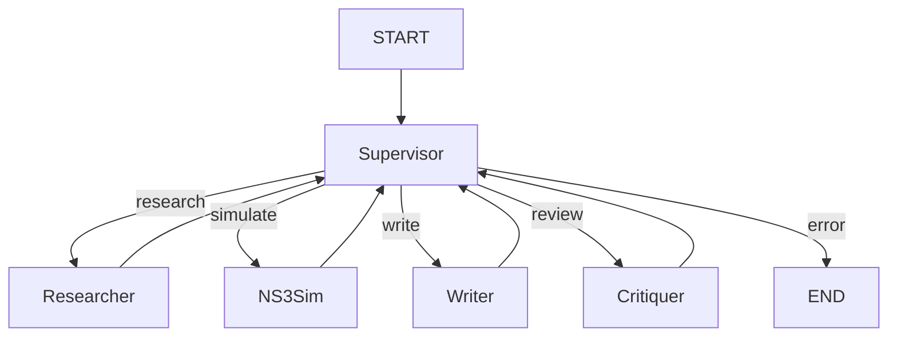

# Capítulo 4: Orquestación de Agentes con LangGraph

## 4.1 Por Qué LangGraph

LangGraph fue elegido sobre AutoGen/CrewAI por:

| Factor | LangGraph | AutoGen | CrewAI |
|--------|-----------|---------|--------|
| **State persistence** | ✅ Checkpoints SQLite/Postgres | ❌ Solo historia conversación | ❌ |
| **Deterministic routing** | ✅ Edges condicionales | ❌ LLM decide próximo agente | ❌ |
| **Human-in-the-loop** | ✅ `interrupt()` nativo | ✅ User proxy | ⚠️ |
| **MCP integration** | ✅ Custom tools | ✅ Native | ❌ |
| **Local LLM (Ollama)** | ✅ Via `ChatOllama` | ✅ | ✅ |
| **Debugging** | ✅ LangGraph Studio | ❌ | ❌ |

## 4.2 Arquitectura del Orquestador v2

### 4.2.1 State Schema
```python
class JARVISState(TypedDict):
    # Input
    user_query: str
    task_type: Literal["research", "simulation", "writing", "review"]
    
    # Research
    evidence_package: List[Evidence]      # PaperQA2 results
    research_notes: List[str]             # personal-mcp notes
    
    # Writing
    draft_markdown: str                   # Writer output
    docx_path: Optional[str]              # Pandoc output
    
    # Simulation
    ns3_task: Optional[NS3Task]           # Parámetros simulación
    ns3_manifest: Optional[Dict]          # manifest.json
    ns3_results: Optional[Dict]           # Resultados parseados
    
    # Review
    critique_report: Optional[Critique]   # AutoGen group chat result
    
    # Memory
    memory_context: List[Memory]          # Mem0 context
    
    # Control
    current_node: str
    retry_count: int
    error: Optional[str]
```

### 4.2.2 Grafo de 5 Nodos



### 4.2.3 Nodos Detallados

#### Nodo 1: Supervisor (Deterministic + LLM Fallback)
```python
def supervisor_node(state: JARVISState) -> JARVISState:
    # 1. Reglas determinísticas primero
    if state.get("error"):
        return route_to_critiquer(state)
    if not state.get("evidence_package") and needs_research(state["user_query"]):
        return route_to_researcher(state)
    if state.get("ns3_task") and not state.get("ns3_results"):
        return route_to_ns3(state)
    if state.get("draft_markdown") and not state.get("docx_path"):
        return route_to_writer(state)
    if state.get("docx_path") and not state.get("critique_report"):
        return route_to_critiquer(state)
    
    # 2. LLM fallback para decisiones ambiguas
    decision = llm_decide_next_node(state)
    return route(decision, state)
```

#### Nodo 2: Researcher (PaperQA2 + MCP)
```python
async def researcher_node(state: JARVISState) -> JARVISState:
    # 1. PaperQA2 query con evidencia
    evidence = await paperqa_query(
        query=state["user_query"],
        settings=PAPERQA_SETTINGS  # think:false, FakeAgent, timeout 300s
    )
    
    # 2. Búsqueda complementaria via research-mcp
    arxiv_results = await mcp_call("research-mcp", "search_arxiv", {...})
    openalex_results = await mcp_call("research-mcp", "search_openalex", {...})
    
    # 3. Guardar notas en personal-mcp
    for note in evidence + arxiv_results + openalex_results:
        await mcp_call("personal-mcp", "add_note", {...})
    
    return {
        **state,
        "evidence_package": evidence,
        "research_notes": [n.id for n in notes],
        "current_node": "researcher"
    }
```

#### Nodo 3: Writer (Markdown + Pandoc + Zotero)
```python
async def writer_node(state: JARVISState) -> JARVISState:
    # 1. Generar Markdown con evidencia
    markdown = await generate_markdown(
        evidence=state["evidence_package"],
        template="academic_paper",
        citations_style="ieee"
    )
    
    # 2. Pandoc: Markdown → DOCX/LaTeX
    docx_path = await pandoc_convert(markdown, "docx", citations=True)
    tex_path = await pandoc_convert(markdown, "latex", citations=True)
    
    # 3. Zotero: crear entradas bibliográficas
    await zotero_add_items(evidence)
    
    return {
        **state,
        "draft_markdown": markdown,
        "docx_path": docx_path,
        "tex_path": tex_path,
        "current_node": "writer"
    }
```

#### Nodo 4: NS-3 Simulation (ns3-mcp + run_tracked.py)
```python
async def ns3_simulation_node(state: JARVISState) -> JARVISState:
    task = state["ns3_task"]
    
    # 1. Ejecutar via ns3-mcp (HTTP :8002)
    result = await mcp_call("ns3-mcp", "run_ns3_simulation", {
        "script": task.script,
        "params": task.params,
        "seed": task.seed,
        "repetitions": task.repetitions,
        "trace": True
    })
    
    # 2. Leer manifest.json generado por run_tracked.py
    manifest = await read_manifest(result.run_dir)
    
    # 4. Parsear resultados (FlowMonitor, PCAP, logs)
    parsed = await parse_ns3_results(result.run_dir)
    
    return {
        **state,
        "ns3_manifest": manifest,
        "ns3_results": parsed,
        "current_node": "ns3_simulation"
    }
```

#### Nodo 5: Critiquer (AutoGen Group Chat)
```python
async def critiquer_node(state: JARVISState) -> JARVISState:
    # 5 agentes especializados en Group Chat
    agents = [
        CoverageCritic(),      # ¿Cubre todo lo necesario?
        EvidenceCritic(),      # ¿Evidencia suficiente y citada?
        StructureCritic(),     # ¿Estructura académica correcta?
        ClarityCritic(),       # ¿Claridad y legibilidad?
        ActionabilityCritic()  # ¿Acciones concretas propuestas?
    ]
    
    group_chat = GroupChat(
        agents=agents,
        messages=[],
        max_round=10,
        speaker_selection_method="round_robin"
    )
    
    critique = await group_chat.run(
        task=f"Revisar paper: {state['draft_markdown']}",
        evidence=state["evidence_package"]
    )
    
    return {
        **state,
        "critique_report": critique,
        "current_node": "critiquer"
    }
```

## 4.3 Configuración PaperQA2 para qwen3:8b Local

```python
# config_paperqa.py - CRÍTICO: unset variables ANTES de imports
for var in ['AGENT', 'OPENAI_API_KEY', 'OPENAI_API_BASE', 
            'OPENROUTER_API_KEY', 'OPENAI_ADMIN_KEY', 'OPENAI_ORGANIZATION']:
    os.environ.pop(var, None)

os.environ['OPENAI_API_KEY'] = 'EMPTY'
os.environ['OPENAI_API_BASE'] = 'http://127.0.0.1:11434/v1'
os.environ['OLLAMA_API_BASE'] = 'http://127.0.0.1:11434'

# Override de los 4 modelos que usa PaperQA2
OLLAMA_MODEL_NAME = "ollama/qwen3:8b"
OLLAMA_LEGACY_CONFIG = {
    "name": OLLAMA_MODEL_NAME,
    "model_list": [{
        "model_name": OLLAMA_MODEL_NAME,
        "litellm_params": {
            "model": OLLAMA_MODEL_NAME,
            "temperature": 0.0,
            "api_base": "http://127.0.0.1:11434",
            "extra_body": {"think": False},  # CRÍTICO: top-level, NO en options
            "timeout": 300,
        }
    }]
}

# Settings para aquery/aadd
settings = Settings(
    llm=OLLAMA_MODEL_NAME,
    summary_llm=OLLAMA_MODEL_NAME,
    agent_llm=OLLAMA_MODEL_NAME,
    enrichment_llm=OLLAMA_MODEL_NAME,
    agent_type="FakeAgent",      # Evita tool-calling loop quebrado
    multimodal=0,
    embedding="ollama/nomic-embed-text",
    **OLLAMA_LEGACY_CONFIG
)
```

**Tiempos validados**:
- `qwen2.5-coder:7b`: 37s (coding/NS-3)
- `qwen3:8b` + `think:false`: 92s (reasoning/drafting)

## 4.4 Manejo de Errores y Reintentos

### 4.4.1 arXiv Timeout Fix
```python
# research-mcp: search_arxiv con backoff exponencial
async def search_arxiv_with_retry(query: str, max_retries=3):
    for attempt in range(max_retries):
        try:
            timeout = aiohttp.ClientTimeout(total=60)
            async with aiohttp.ClientSession(timeout=timeout) as session:
                return await arxiv_search(session, query)
        except asyncio.TimeoutError:
            wait = 10 * (2 ** attempt)  # 10s, 20s, 40s
            await asyncio.sleep(wait)
        except aiohttp.ClientResponseError as e:
            if e.status == 429:  # Rate limit
                wait = 30 * (2 ** attempt)
                await asyncio.sleep(wait)
            else:
                raise
    raise Exception("arXiv: max retries exceeded")
```

### 4.4.2 OpenAlex/Crossref Timeouts
```python
# 30s timeout + 3 retries con backoff
HTTP_TIMEOUT = 30
MAX_RETRIES = 3
BACKOFF_BASE = 2
```

## 4.5 Checkpointing y Recuperación

```python
# LangGraph checkpointer SQLite
from langgraph.checkpoint.sqlite import SqliteSaver

checkpointer = SqliteSaver.from_conn_string("sqlite:///checkpoints.db")

# En orchestrator:
graph = builder.compile(checkpointer=checkpointer)

# Recuperación:
config = {"configurable": {"thread_id": "experiment_001"}}
state = graph.get_state(config)
# Reanudar desde último checkpoint exitoso
```